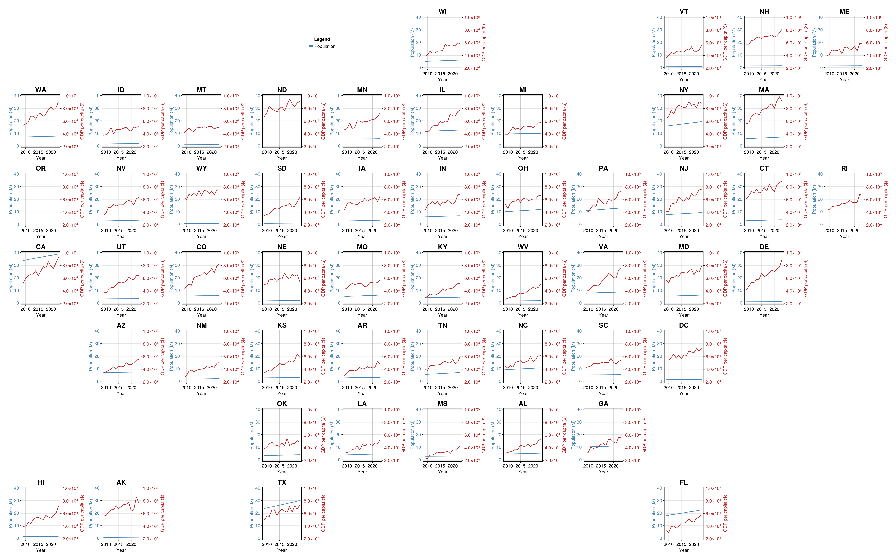

### [<i class="bi bi-github"></i>](https://github.com/arnold-c/GeoFacetMakie.jl) [GeoFacetMakie.jl](https://geofacetmakie.callumarnold.com/dev/)

A Julia package for Makie plotting that produces geographically representative distribution of plot facets, analogous to the [geofacet](https://hafen.github.io/geofacet/) R ggplot2 package.

::: {.project-screenshot}

:::

### [<i class="bi bi-github"></i> Beancount plugins](https://github.com/arnold-c/CallumsBeancountPlugins)

A collection of [Beancount](https://beancount.github.io/docs/) and [Fava](https://beancount.github.io/fava/) plugins for Canadian personal-finance workflows, including adjusted cost base tracking, realized gains reporting, and registered account contribution room estimation.

### [<i class="bi bi-github"></i> Canada Presence Calculator](https://github.com/arnold-c/CanadaPresenceCalculator)

A Rust command-line tool for tracking time spent in Canada from calendar data to help estimate permanent residency status maintenance and calculate citizenship application date eligibility (and forecasted eligibility date if not currently eligible).
Connects to an individual's online calendar to calculate the eligibility, as well as produce CSV files that summarize entry/exit events in the format required to complete the [official eligibility calculator](https://eservices.cic.gc.ca/rescalc/resCalcRetrieve.do?&lang=en).
